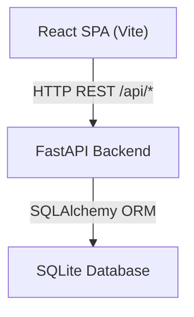

# Design Document: Support CRM System

## Overview

A full-stack Customer Support CRM built with:
- **Backend**: Python 3.11 + FastAPI
- **Database**: SQLite (via SQLAlchemy ORM)
- **Frontend**: React 18 + Vite + Tailwind CSS
- **Deployment**: Railway.app (backend + frontend served as static build, or separate services)

The app is a single-page application (SPA). React handles routing client-side. FastAPI serves the REST API. The SQLite database file is persisted on the Railway volume.

---

## Architecture



Two deployment options on Railway:
1. **Monorepo**: FastAPI serves the React build as static files + the API under `/api`. Single Railway service.
2. **Separate services**: Frontend on Vercel/Railway static, backend on Railway.

Recommended: **Option 1 (monorepo)** — simpler for a 3-day project. FastAPI uses `StaticFiles` to serve the Vite build output.

---

## Components and Interfaces

### Backend (FastAPI)

```
backend/
  main.py          # App entry point, CORS, static file mount
  database.py      # SQLAlchemy engine + session setup
  models.py        # ORM models: Ticket, Note
  schemas.py       # Pydantic request/response schemas
  crud.py          # DB operations (create, read, update)
  routers/
    tickets.py     # All /api/tickets routes
```

### Frontend (React + Vite)

```
frontend/
  src/
    api.js             # Axios/fetch wrapper for all API calls
    App.jsx            # Router setup (React Router v6)
    pages/
      HomePage.jsx     # Ticket list + search + filter
      CreateTicket.jsx # New ticket form
      TicketDetail.jsx # Full ticket view + update + notes
    components/
      TicketCard.jsx   # Single row in ticket list
      StatusBadge.jsx  # Colored badge for status
      SearchBar.jsx    # Controlled search input
      FilterBar.jsx    # Status filter buttons
      NoteItem.jsx     # Single note display
```

---

## Data Models

### SQLite Tables (SQLAlchemy ORM)

#### Ticket
| Column         | Type      | Notes                        |
|----------------|-----------|------------------------------|
| id             | Integer   | Primary key, auto-increment  |
| ticket_id      | String    | Unique, e.g. TKT-001         |
| customer_name  | String    | Required                     |
| customer_email | String    | Required                     |
| subject        | String    | Required                     |
| description    | Text      | Required                     |
| status         | String    | Default: "Open"              |
| created_at     | DateTime  | Auto-set on insert           |
| updated_at     | DateTime  | Auto-updated on change       |

#### Note
| Column     | Type     | Notes                          |
|------------|----------|--------------------------------|
| id         | Integer  | Primary key, auto-increment    |
| ticket_id  | String   | Foreign key → tickets.ticket_id|
| note_text  | Text     | Required                       |
| created_at | DateTime | Auto-set on insert             |

### Ticket ID Generation

On each ticket creation, query the maximum numeric suffix from existing ticket_id values, then generate: `TKT-{max+1:03d}` (zero-padded to 3 digits). Using the max suffix instead of row count avoids collisions when tickets are deleted and reduces (but does not fully eliminate) the race condition window for an SQLite MVP. For this single-user demo context, SQLite's serialized write mode provides sufficient protection.

### Pydantic Schemas

**Request — Create Ticket:**
```python
class TicketCreate(BaseModel):
    customer_name: str
    customer_email: str
    subject: str
    description: str
```

**Request — Update Ticket:**
```python
class TicketUpdate(BaseModel):
    status: Optional[str] = None
    note_text: Optional[str] = None
```

**Response — Ticket List Item:**
```python
class TicketListItem(BaseModel):
    ticket_id: str
    customer_name: str
    subject: str
    status: str
    created_at: datetime
```

**Response — Ticket Detail:**
```python
class TicketDetail(BaseModel):
    ticket_id: str
    customer_name: str
    customer_email: str
    subject: str
    description: str
    status: str
    created_at: datetime
    updated_at: datetime
    notes: List[NoteOut]
```

---

## API Endpoints

| Method | Path                       | Description                        |
|--------|----------------------------|------------------------------------|
| POST   | /api/tickets               | Create a new ticket                |
| GET    | /api/tickets               | List tickets (search + filter)     |
| GET    | /api/tickets/{ticket_id}   | Get full ticket detail + notes     |
| PUT    | /api/tickets/{ticket_id}   | Update status and/or add a note    |

### Search & Filter (GET /api/tickets)

Query params:
- `?search=<string>` — case-insensitive match against ticket_id, customer_name, customer_email, description
- `?status=Open|In Progress|Closed` — exact match on status
- Both can be combined

Search is done server-side using SQLAlchemy `ilike` filters with `OR` across the four columns.

---

## Frontend Pages

### HomePage (`/`)
- Fetches all tickets on mount via `GET /api/tickets`
- Search bar triggers re-fetch or client-side filter on each keystroke
- Status filter buttons re-fetch with `?status=` param
- Each ticket row links to `/tickets/:ticketId`

### CreateTicket (`/new`)
- Controlled form with 4 fields
- On submit: `POST /api/tickets`
- On success: redirects to `HomePage`
- Shows inline validation errors for empty fields

### TicketDetail (`/tickets/:ticketId`)
- Fetches `GET /api/tickets/:ticketId` on mount
- Shows all ticket fields + notes list
- Status dropdown + "Update" button → `PUT /api/tickets/:ticketId`
- Note textarea + "Add Note" button → `PUT /api/tickets/:ticketId` with note_text
- Shows 404 message if ticket not found

---

## Error Handling

| Scenario                          | Backend Response        | Frontend Behavior                     |
|-----------------------------------|-------------------------|---------------------------------------|
| Required field missing            | HTTP 422 (FastAPI auto) | Show field-level validation error     |
| Ticket ID not found (GET/PUT)     | HTTP 404 + detail msg   | Display "Ticket not found" message    |
| DB or unexpected server error     | HTTP 500 + detail msg   | Display generic error banner          |
| No tickets match search/filter    | HTTP 200, empty array   | Display "No tickets found" message    |

CORS is configured in FastAPI to allow requests from the frontend origin (or `*` in development).

---

## Testing Strategy

- **Backend**: `pytest` + `httpx` (FastAPI `TestClient`) for API route tests covering create, list, get, update, and 404 cases.
- **Frontend**: Manual smoke testing across all pages. No automated frontend tests required for MVP.
- **Integration**: Verified by running the full stack locally before deployment.

---

## Deployment Plan

1. Build React app: `npm run build` → outputs to `frontend/dist`
2. FastAPI mounts `frontend/dist` as static files at `/`
3. Single `Procfile` or `railway.toml` starts the FastAPI server with `uvicorn`
4. SQLite database file stored at `/data/crm.db` using Railway's persistent volume
5. `.env.example` documents `DATABASE_URL` and `FRONTEND_ORIGIN` variables

### Folder Structure (Monorepo)

```
support-crm/
  backend/
    main.py
    database.py
    models.py
    schemas.py
    crud.py
    routers/
      tickets.py
    requirements.txt
  frontend/
    src/
    index.html
    package.json
    vite.config.js
  Procfile
  README.md
  .env.example
  .gitignore
```
